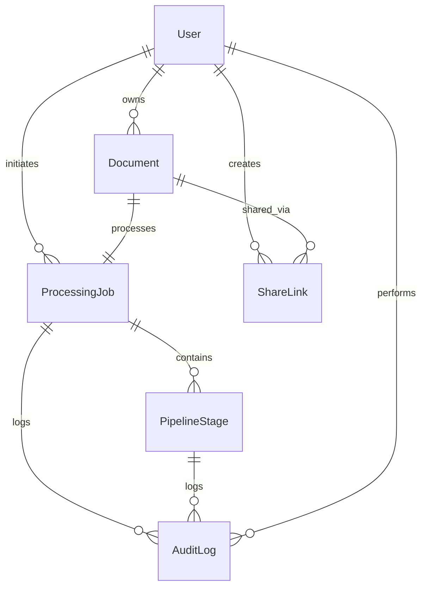

# Data Model: Digital Document Processing System

**Date**: 2025-09-17  
**Feature**: Document Processing System  
**Status**: Complete  

## Entity Relationship Overview



## Core Entities

### User
**Purpose**: Represents authenticated users with permissions and document ownership
**Source**: FR-001, FR-011 (User accounts and authentication)

```csharp
public class User
{
    public Guid Id { get; set; }
    public string EntraId { get; set; }                    // Microsoft Entra ID identifier
    public string Email { get; set; }
    public string DisplayName { get; set; }
    public UserRole Role { get; set; }                     // Admin, Standard, ReadOnly
    public DateTime CreatedAt { get; set; }
    public DateTime LastLoginAt { get; set; }
    public bool IsActive { get; set; }
    
    // Navigation Properties
    public ICollection<Document> Documents { get; set; }
    public ICollection<ShareLink> SharedLinks { get; set; }
    public ICollection<AuditLog> AuditLogs { get; set; }
}

public enum UserRole
{
    Admin = 1,      // Full system access, configuration management
    Standard = 2,   // Document upload, manage own documents
    ReadOnly = 3    // View shared documents only
}
```

**Validation Rules**:
- Email must be valid format (from Entra ID)
- EntraId must be unique and non-null
- Role assignment follows principle of least privilege
- CreatedAt and LastLoginAt use UTC timestamps

### Document
**Purpose**: Represents uploaded files with metadata and processing status
**Source**: FR-003, FR-016, FR-017, FR-018 (Document upload, validation, metadata)

```csharp
public class Document
{
    public Guid Id { get; set; }
    public string FileName { get; set; }
    public string OriginalFileName { get; set; }
    public long FileSizeBytes { get; set; }
    public string ContentType { get; set; }
    public string BlobStoragePath { get; set; }           // Azure Blob Storage location
    public string FileHash { get; set; }                 // SHA-256 for duplicate detection
    public DocumentStatus Status { get; set; }
    public DateTime UploadedAt { get; set; }
    public DateTime? ProcessedAt { get; set; }
    public string ProcessingError { get; set; }
    public Dictionary<string, object> Metadata { get; set; } // Extracted content metadata
    public bool IsDeleted { get; set; }
    public DateTime? DeletedAt { get; set; }
    
    // Foreign Keys
    public Guid OwnerId { get; set; }
    
    // Navigation Properties
    public User Owner { get; set; }
    public ProcessingJob ProcessingJob { get; set; }
    public ICollection<ShareLink> ShareLinks { get; set; }
}

public enum DocumentStatus
{
    Uploaded = 1,       // File received, awaiting processing
    Processing = 2,     // In processing pipeline
    Processed = 3,      // Successfully processed
    Failed = 4,         // Processing failed
    PendingUser = 5     // Awaiting user interaction
}
```

**Validation Rules**:
- FileName must be safe for file system (no path traversal)
- FileSizeBytes must be within configured limits (default 10MB)
- ContentType must be in allowed formats (PDF, Office, text)
- FileHash used for duplicate detection across users
- Soft delete with audit trail

### ProcessingJob
**Purpose**: Tracks document processing through multi-stage pipeline
**Source**: FR-006, FR-007, FR-008, FR-013, FR-014, FR-015 (Pipeline processing)

```csharp
public class ProcessingJob
{
    public Guid Id { get; set; }
    public Guid DocumentId { get; set; }
    public ProcessingStatus Status { get; set; }
    public int CurrentStageIndex { get; set; }
    public DateTime StartedAt { get; set; }
    public DateTime? CompletedAt { get; set; }
    public DateTime? FailedAt { get; set; }
    public string ErrorMessage { get; set; }
    public Dictionary<string, object> Configuration { get; set; } // Stage-specific config
    public Dictionary<string, object> Results { get; set; }       // Processing outputs
    public bool RequiresUserInteraction { get; set; }
    public DateTime? UserInteractionRequestedAt { get; set; }
    public DateTime? UserInteractionCompletedAt { get; set; }
    
    // Navigation Properties
    public Document Document { get; set; }
    public ICollection<PipelineStage> Stages { get; set; }
    public ICollection<AuditLog> AuditLogs { get; set; }
}

public enum ProcessingStatus
{
    Queued = 1,             // Waiting to start
    Running = 2,            // Currently processing
    PendingUser = 3,        // Waiting for user input
    Completed = 4,          // Successfully finished
    Failed = 5,             // Processing failed
    Cancelled = 6           // User or system cancelled
}
```

**State Transitions**:
- Queued → Running → (PendingUser →) Completed/Failed/Cancelled
- Failed jobs can be retried (reset to Queued)
- User interaction timeout configurable per stage

### PipelineStage
**Purpose**: Individual processing steps with configuration and execution state
**Source**: FR-006, FR-015 (Multi-stage pipeline, error handling)

```csharp
public class PipelineStage
{
    public Guid Id { get; set; }
    public Guid ProcessingJobId { get; set; }
    public string StageName { get; set; }                 // OCR, Classification, Validation, etc.
    public int OrderIndex { get; set; }
    public StageStatus Status { get; set; }
    public DateTime? StartedAt { get; set; }
    public DateTime? CompletedAt { get; set; }
    public TimeSpan? Duration { get; set; }
    public Dictionary<string, object> Configuration { get; set; }
    public Dictionary<string, object> Input { get; set; }
    public Dictionary<string, object> Output { get; set; }
    public string ErrorMessage { get; set; }
    public int RetryCount { get; set; }
    public int MaxRetries { get; set; }
    public bool RequiresUserInteraction { get; set; }
    
    // Navigation Properties
    public ProcessingJob ProcessingJob { get; set; }
}

public enum StageStatus
{
    Pending = 1,            // Not started
    Running = 2,            // Currently executing
    Completed = 3,          // Successfully finished
    Failed = 4,             // Failed execution
    Skipped = 5,            // Skipped due to conditions
    PendingUser = 6         // Waiting for user input
}
```

**Configuration Examples**:
- OCR Stage: `{ "language": "en", "confidence_threshold": 0.8 }`
- Validation Stage: `{ "required_fields": ["title", "date"], "user_interaction": true }`

### ShareLink
**Purpose**: Document sharing with access controls and expiration
**Source**: FR-010, FR-021 (Document sharing, role-based access)

```csharp
public class ShareLink
{
    public Guid Id { get; set; }
    public Guid DocumentId { get; set; }
    public Guid CreatedById { get; set; }
    public string AccessToken { get; set; }               // Unique access token
    public ShareAccessLevel AccessLevel { get; set; }
    public DateTime CreatedAt { get; set; }
    public DateTime? ExpiresAt { get; set; }
    public bool IsActive { get; set; }
    public int AccessCount { get; set; }
    public DateTime? LastAccessedAt { get; set; }
    public string RecipientEmail { get; set; }            // Optional specific recipient
    public string Description { get; set; }               // Optional share description
    
    // Navigation Properties
    public Document Document { get; set; }
    public User CreatedBy { get; set; }
}

public enum ShareAccessLevel
{
    ViewOnly = 1,       // Can view document content
    Download = 2        // Can view and download
}
```

**Security Rules**:
- AccessToken is cryptographically secure random string
- Expired links automatically deactivated
- Access logging for audit compliance
- Optional recipient email for targeted sharing

### AuditLog
**Purpose**: Comprehensive audit trail for compliance and security
**Source**: FR-012, FR-020 (Audit logging, compliance)

```csharp
public class AuditLog
{
    public Guid Id { get; set; }
    public Guid? UserId { get; set; }                     // Null for system actions
    public string Action { get; set; }                   // LOGIN, UPLOAD, SHARE, DELETE, etc.
    public string EntityType { get; set; }               // Document, User, ProcessingJob, etc.
    public Guid? EntityId { get; set; }
    public Dictionary<string, object> Details { get; set; } // Action-specific data
    public string IpAddress { get; set; }
    public string UserAgent { get; set; }
    public DateTime Timestamp { get; set; }
    public AuditLevel Level { get; set; }
    public bool IsSystemAction { get; set; }
    
    // Navigation Properties
    public User User { get; set; }
}

public enum AuditLevel
{
    Info = 1,           // General operations
    Warning = 2,        // Unusual but valid operations
    Error = 3,          // Failed operations
    Security = 4        // Security-relevant events
}
```

**Standard Actions**:
- User: `LOGIN`, `LOGOUT`, `PROFILE_UPDATE`, `ROLE_CHANGE`
- Document: `UPLOAD`, `VIEW`, `DOWNLOAD`, `SHARE`, `DELETE`, `PROCESS_START`, `PROCESS_COMPLETE`
- System: `BACKUP_START`, `BACKUP_COMPLETE`, `MAINTENANCE_MODE`, `CONFIGURATION_CHANGE`

## Database Schema Considerations

### Indexing Strategy
```sql
-- User lookups
CREATE INDEX IX_User_EntraId ON Users(EntraId);
CREATE INDEX IX_User_Email ON Users(Email);

-- Document queries
CREATE INDEX IX_Document_OwnerId ON Documents(OwnerId);
CREATE INDEX IX_Document_Status ON Documents(Status);
CREATE INDEX IX_Document_UploadedAt ON Documents(UploadedAt);
CREATE INDEX IX_Document_FileHash ON Documents(FileHash);

-- Processing job tracking
CREATE INDEX IX_ProcessingJob_DocumentId ON ProcessingJobs(DocumentId);
CREATE INDEX IX_ProcessingJob_Status ON ProcessingJobs(Status);
CREATE INDEX IX_ProcessingJob_StartedAt ON ProcessingJobs(StartedAt);

-- Share link access
CREATE INDEX IX_ShareLink_AccessToken ON ShareLinks(AccessToken);
CREATE INDEX IX_ShareLink_DocumentId ON ShareLinks(DocumentId);
CREATE INDEX IX_ShareLink_ExpiresAt ON ShareLinks(ExpiresAt);

-- Audit queries
CREATE INDEX IX_AuditLog_UserId_Timestamp ON AuditLogs(UserId, Timestamp);
CREATE INDEX IX_AuditLog_EntityType_EntityId ON AuditLogs(EntityType, EntityId);
CREATE INDEX IX_AuditLog_Timestamp ON AuditLogs(Timestamp);
```

### Data Retention Policies
- **AuditLog**: Configurable retention (default 7 years)
- **Documents**: Configurable retention based on user/admin settings
- **ProcessingJobs**: Retain for 1 year for troubleshooting
- **ShareLinks**: Auto-cleanup expired links after 30 days

### Backup Strategy
- **Full backup**: Daily during off-peak hours
- **Transaction log backup**: Every 15 minutes
- **Point-in-time recovery**: 30-day window
- **Cross-region replication**: For disaster recovery

## Constitutional Compliance

✅ **Security by Default**: All entities include audit trails and soft deletes  
✅ **Event-Driven Design**: ProcessingJob state changes emit events  
✅ **Contract Compliance**: All entities map to API contract definitions  
✅ **Observability**: Built-in timing and logging fields  
✅ **Pragmatic Simplicity**: Standard EF Core patterns, no over-engineering  

## Implementation Notes

### Entity Framework Configuration
- Use Fluent API for complex relationships
- Implement soft delete query filters globally
- Configure JSON columns for metadata dictionaries
- Use value converters for enums
- Implement optimistic concurrency with timestamps

### Data Migration Strategy
- Code-first migrations with EF Core
- Seed data for initial admin user and pipeline stages
- Environment-specific configuration values
- Rollback procedures for failed deployments